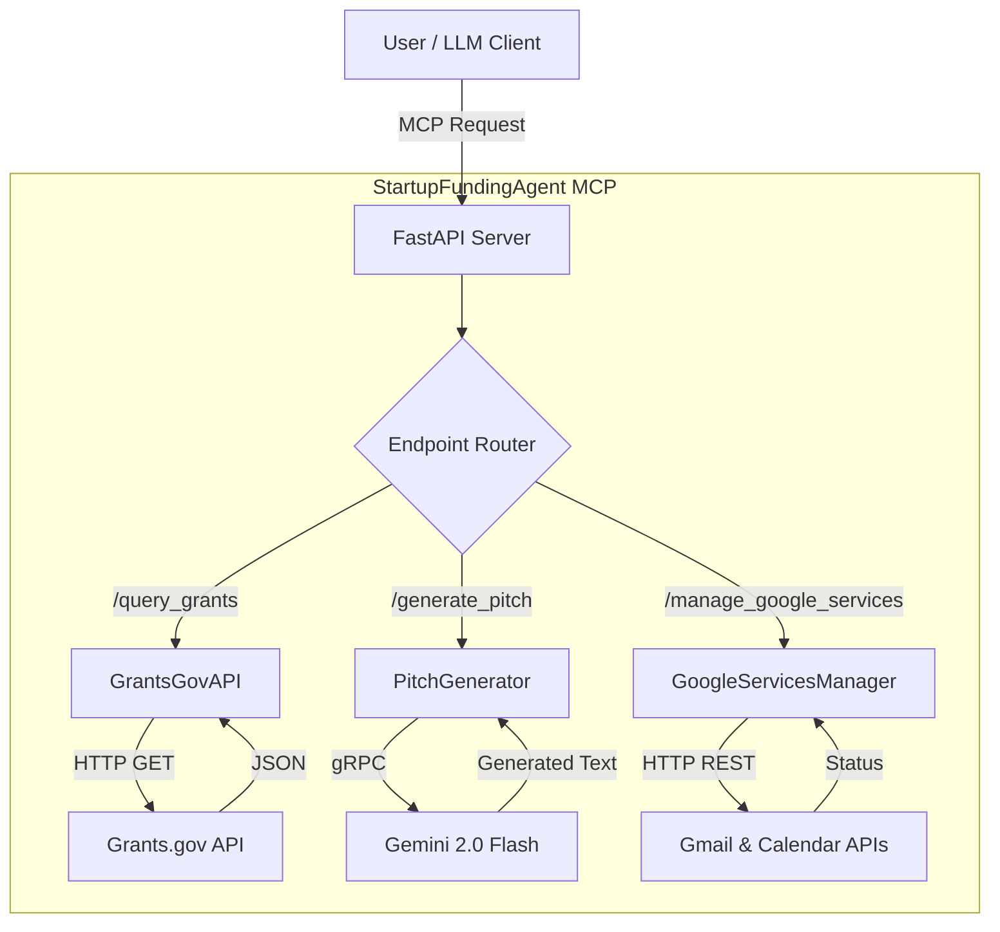

# Technical Documentation - StartupFundingAgent

## 🏗️ Architecture Overview

The **StartupFundingAgent** (Grant Hunter MCP) is built as a stateless, containerized microservice using **FastAPI**. It adheres to the **Model Context Protocol (MCP)** standard, allowing it to function as an intelligent tool provider for LLM agents (like Claude or Gemini).

### System Diagram

---

## 🧩 Component Analysis

### 1. `GrantsGovAPI` (`grants_gov_api.py`)
*   **Purpose**: Interfaces with the Grants.gov public API to search for funding opportunities.
*   **Key Logic**:
    *   **Search**: Uses the `search_grants` method to query by keyword.
    *   **Deduplication**: Filters out duplicate opportunity numbers to ensure clean results.
    *   **Resilience**: Implements a custom retry loop (5 attempts) with exponential backoff to handle 429 (Rate Limit) and 5xx (Server Error) responses.
    *   **Fallback**: Contains a `MOCK_GRANTS` constant used as a fail-safe if the external API is completely unreachable.

### 2. `PitchGenerator` (`pitch_generator.py`)
*   **Purpose**: Generates high-quality funding pitches using Google's Gemini models.
*   **Key Logic**:
    *   **Model Selection**: Defaults to `gemini-2.0-flash` for speed and quality.
    *   **Prompt Engineering**: Uses a "Triple-Horizon Framework" prompt to structure the output (Acute Pain Point, Technical Deviation, Macro-Economic Lock).
    *   **Fallback Strategy**:
        1.  Try primary model (`gemini-2.0-flash`).
        2.  If failure, try fallback model (`gemini-2.0-flash-lite`).
        3.  If both fail (or no API key), return a deterministic template pitch.

### 3. `GoogleServicesManager` (`google_services_manager.py`)
*   **Purpose**: Handles interactions with Google Workspace (Gmail and Calendar).
*   **Key Logic**:
    *   **Authentication**: Accepts a raw OAuth token at runtime (Stateless). Does **not** manage token refresh or storage (delegated to the client/user).
    *   **Gmail**: Creates a draft email with the pitch and grant details.
    *   **Calendar**: Creates an all-day event for the grant deadline.
    *   **Demo Mode**: If `DEMO_MODE=TRUE` env var is set, it simulates success without making actual API calls.

---

## 🔄 Data Flow

### Grant Discovery Flow
1.  **Request**: Client sends `POST /query_grants` with `keyword`.
2.  **Validation**: Pydantic `GrantsQueryInput` validates the keyword length and parameters.
3.  **Execution**: `GrantsGovAPI` calls external Grants.gov API.
4.  **Processing**: Results are deduplicated, sorted by close date, and formatted.
5.  **Response**: JSON list of `GrantOpportunity` objects.

### Pitch Generation Flow
1.  **Request**: Client sends `POST /generate_pitch` with startup and grant details.
2.  **Prompting**: `PitchGenerator` constructs the Triple-Horizon prompt.
3.  **Inference**: Request sent to Gemini API.
4.  **Response**: Generated pitch text returned to client.

---

## 🛡️ Security Model

### Lethal Trifecta Mitigation
We explicitly address the "Lethal Trifecta" of AI Agent security risks:

1.  **Untrusted Input**: All inputs are strictly typed and validated via Pydantic models (`pydantic_models.py`). This prevents injection attacks and malformed data from crashing the server.
2.  **Implicit Authority**: The agent has **no** implicit authority. It cannot send emails (only drafts) and cannot delete calendar events.
3.  **Unbounded Access**:
    *   **Network**: Outbound requests are limited to specific domains (grants.gov, googleapis.com).
    *   **Filesystem**: The container is read-only (except for tmp), preventing persistence of malicious artifacts.

### Token Handling
*   **Stateless**: The server does not store OAuth tokens. They are passed as arguments to the `/manage_google_services` endpoint.
*   **Ephemeral**: Tokens exist in memory only for the duration of the request.
*   **Environment Variables**: API keys (Gemini) are loaded from `os.environ` and never hardcoded.
